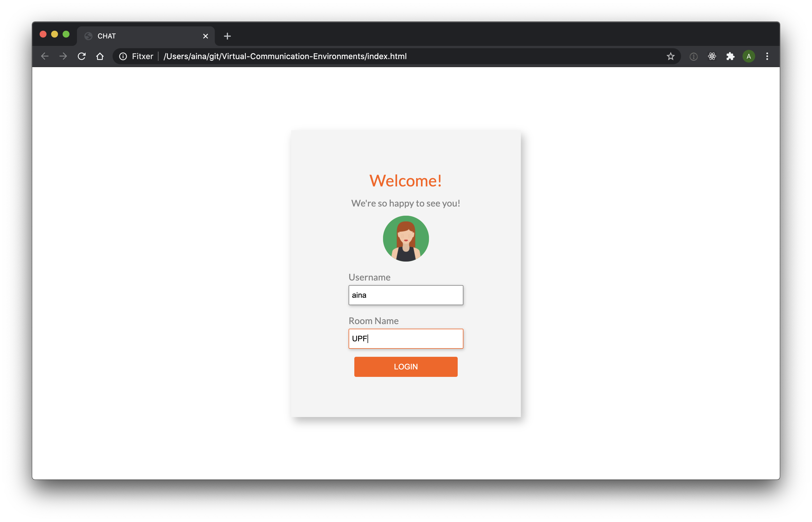
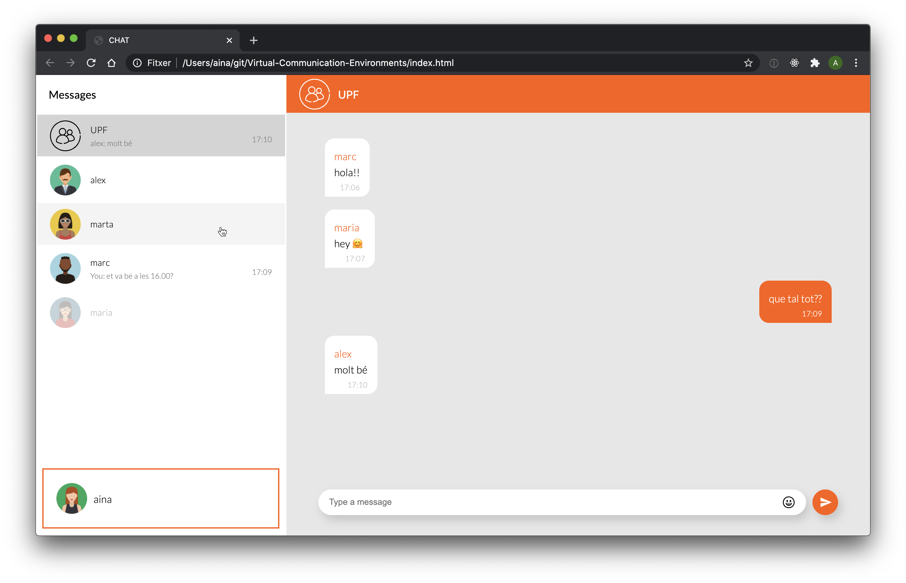

# Lab1: Chat

Aina Vendrell

NIA: 205975

 

When opening the `index.html` file a Login form will be displayed, all the fiels are required (username, room name and avatar). Don't add blank spaces in the username or room name.

  

After the login, the user with the lower ID will send you a message with the database of the chat. It will contain the previous messages that were sent in the room and a list with the information of the other users (id, username, avatar). 

  

After loading the data, you will be able to see the messages of the room and chat with the other users. Using the smiley button on the input area, you will be able to send emojis 😊. In the room, the messages from other users will show the author of the message above the text.

It is also possible to chat in private with other users. To do so, you can select from the list on the left any of the other connected users. This will reload the chat area and then you will be able to see your previous messages with him or start chatting (if it's the first time you talk).

On the list of users on the left, you can see the other connected users and the last message that was sent on each chat. When a user leaves the chat, its contact will be moved to the bottom of the list and get disabled.
